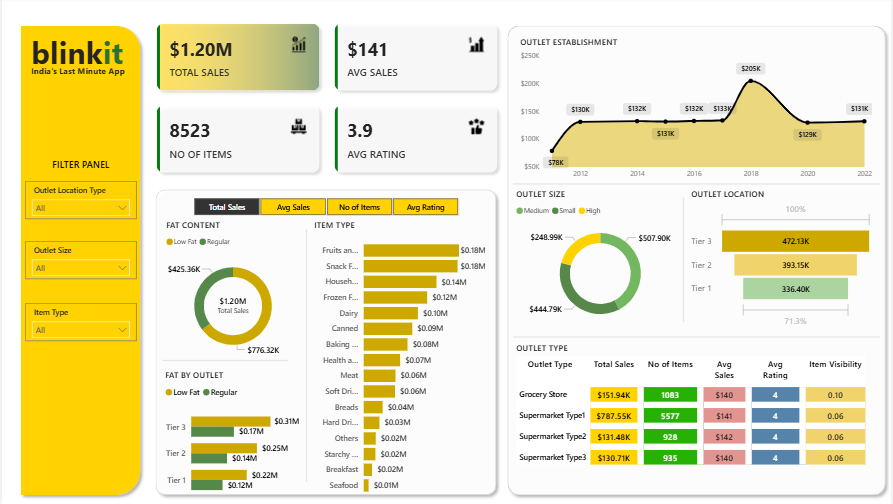

# CodeAlpha_DataVisualization_PowerBI

# 📦 Blinkit Sales Analysis Dashboard | Power BI Project

This project presents a **real-time business intelligence dashboard** developed using Power BI to analyze the sales performance of **Blinkit**, a leading quick-commerce platform in India. The dashboard focuses on key performance metrics, item categories, outlet segmentation, and customer satisfaction insights.

---

## 📌 Business Objective

To conduct a comprehensive analysis of Blinkit's:
- Sales performance
- Customer satisfaction
- Inventory distribution

Using KPIs and visuals to identify key **insights** and **opportunities for optimization**.

---

## 📊 Key KPIs Displayed

1. **Total Sales** – Overall revenue generated from all items sold  
2. **Average Sales** – Average revenue per sale  
3. **Number of Items** – Total number of items sold  
4. **Average Rating** – Average customer satisfaction rating  

---

## 📈 Chart Requirements & Insights

| Chart | Objective | Chart Type |
|-------|-----------|------------|
| **Total Sales by Fat Content** | Analyze the impact of fat content on sales | Donut Chart |
| **Sales by Item Type** | Measure performance of different item types | Bar Chart |
| **Fat Content by Outlet for Total Sales** | Compare total sales by fat type across outlets | Stacked Column Chart |
| **Sales by Outlet Establishment Year** | Track how outlet age impacts sales | Line Chart |
| **Sales by Outlet Size** | Correlate sales with outlet size | Donut/Pie Chart |
| **Sales by Outlet Location** | Evaluate sales distribution by location tiers | Funnel Map |
| **All Metrics by Outlet Type** | Display total metrics across outlet types | Matrix Card |

---

## ⚙️ Project Steps

1. ✅ Requirement Gathering / Business Understanding  
2. ✅ Data Walkthrough  
3. ✅ Data Connection  
4. ✅ Data Cleaning & Quality Check  
5. ✅ Data Modeling  
6. ✅ Data Processing  
7. ✅ DAX Calculations  
8. ✅ Dashboard Layout Planning  
9. ✅ Charts Development & Formatting  
10. ✅ Dashboard Development  
11. ✅ Insights Generation  

---

## 🛠 Tools & Technologies Used

- **Power BI**
- **DAX (Data Analysis Expressions)**
- **Data Cleaning & Transformation**
- **Custom Visualizations and Matrix Cards**

---
